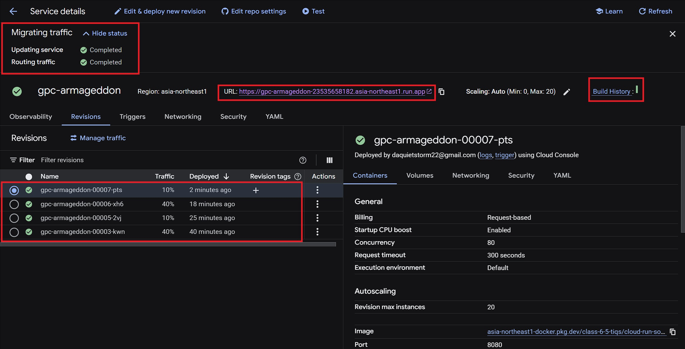

# Armageddon App (Task 2 - V1)

Repo: [gpc-armageddon / task-2](https://github.com/tiqsclass6/gpc-armageddon/tree/task-2)

---


---

## 📖 Overview

This project is part of the **Armageddon App** series and demonstrates deploying a Python-based web application to Google Cloud Run.  
The application is structured with a minimal Flask app (`main.py`), templating via `index.html`, and environment configuration handled through `.env`.

---

## 📂 Project Structure

```plaintext
TASK2-V1/
│
├── Screenshots/
│   ├── armageddon-app.jpg
│   ├── cloud-build.jpg
│   ├── cloud-run-with-revisions.jpg
│   └── github-commit-confirmation.jpg
│
├── templates/
│   └── index.html          # HTML template rendered by Flask
│
├── .env                    # Environment variables file
├── .gitignore              # Git ignore configuration
├── main.py                 # Main Flask application
├── requirements.txt        # Python dependencies
```

---

## 🚀 Deployment

This application can be deployed to **Google Cloud Run** with the following steps:

1. Clone the repository:

   ```bash
   git clone https://github.com/tiqsclass6/gpc-armageddon.git
   cd gpc-armageddon/task-2
   ```

1. Install dependencies locally (optional for testing):

   ```bash
   pip install -r requirements.txt
   ```

1. Deploy to Cloud Run from source:

   ```bash
   gcloud run deploy armageddon-app \
     --region us-central1 \
     --source . \
     --platform managed \
     --allow-unauthenticated
   ```

1. Open the service URL provided after deployment.

---

## 📸 Screenshots

The **Screenshots** folder includes:

- Application UI (`armageddon-app.jpg`)  
- Cloud Build integration (`cloud-build.jpg`)  
- Cloud Run with revisions (`cloud-run-with-revisions.jpg`)  
- GitHub commit confirmation (`github-commit-confirmation.jpg`)  

---

## 🔀 Traffic Splitting

The service is deployed with **four revisions**, splitting traffic across them at **40% / 40% / 10% / 10%**.



Service URL (example):  
`https://gpc-armageddon-23535658182.asia-northeast1.run.app`

---

## 🛠️ Tech Stack

- **Python 3**  
- **Flask** for web application framework  
- **Google Cloud Run** for serverless deployment  
- **Cloud Build** for CI/CD from GitHub  

---

## 🛠️ Troubleshooting

1. ModuleNotFoundError: No module named `flask`  
   Ensure dependencies are installed:  

   ```bash
   pip install -r requirements.txt
   ```

1. Service deploys but returns 502/503  
   Verify the Flask app is binding to `0.0.0.0` and the port provided by Cloud Run:  

   ```python
   app.run(host="0.0.0.0", port=int(os.environ.get("PORT", 8080)))
   ```

1. Permission denied when accessing the service  
   Check if you allowed unauthenticated access:  

   ```bash
   gcloud run services add-iam-policy-binding armageddon-app \
     --region us-central1 \
     --member="allUsers" \
     --role="roles/run.invoker"
   ```

1. Continuous Deployment build fails  
   Make sure Cloud Build API is enabled in your project:  

   ```bash
   gcloud services enable cloudbuild.googleapis.com
   ```

   Confirm the GitHub repo is connected under **Cloud Build → Triggers**.

1. Environment variables not applied  
   Add them under **Cloud Run → Service → Edit & Deploy New Revision → Variables & Secrets**.  
   Re-deploy to apply changes.

---

## 📌 Notes

- Make sure to configure environment variables in `.env` (kept local).  
- `.gitignore` ensures secrets and local configs don’t get committed.  
- `requirements.txt` contains all necessary dependencies for deployment.  

---
