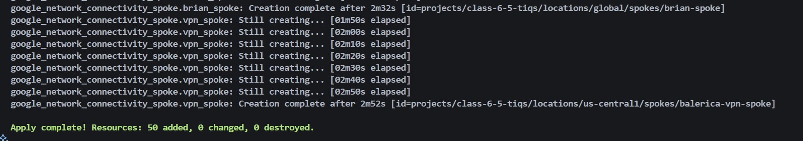
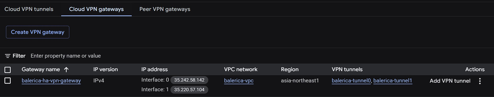
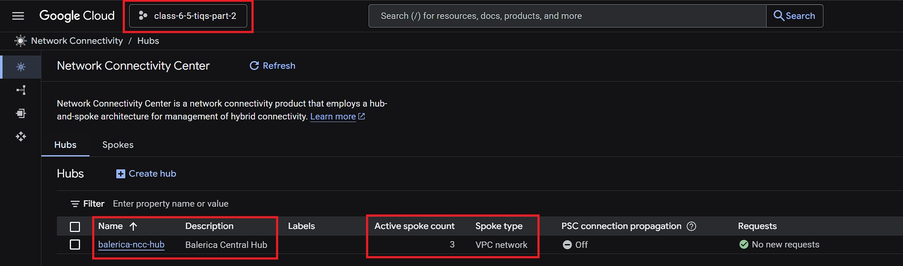
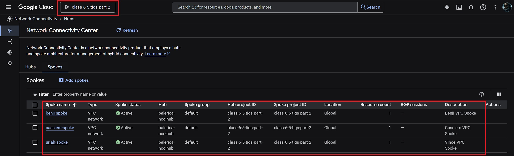
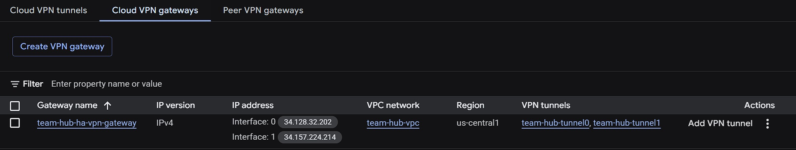
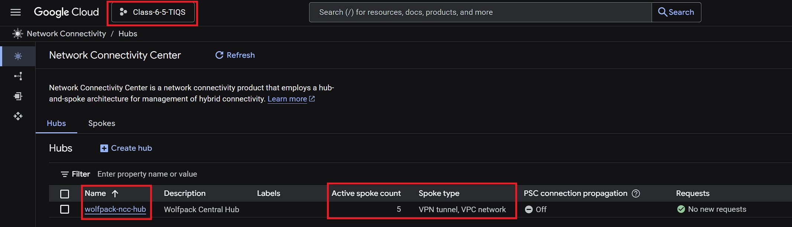
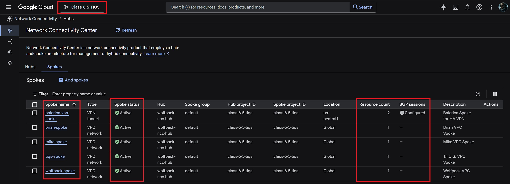
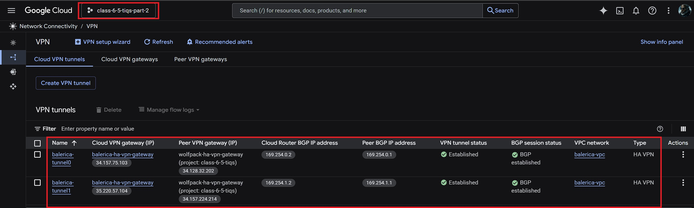
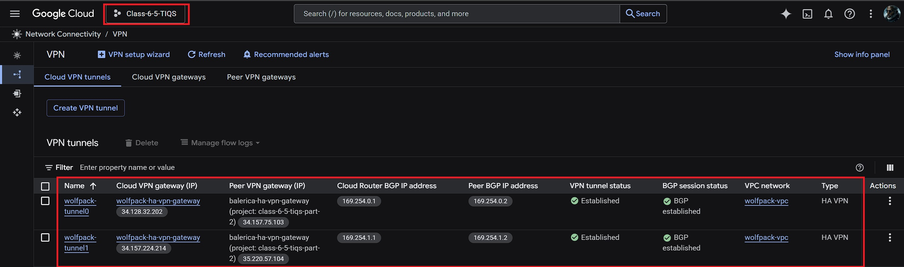
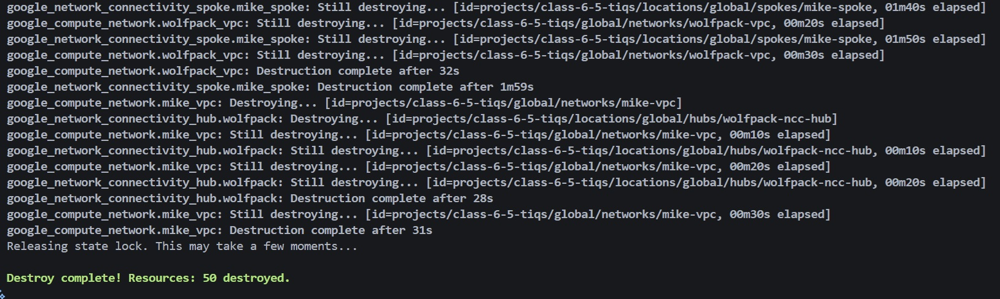

# Armageddon Task 1 - HA VPN with NCC via Hub-and-Spokes (in Terraform)


---


## 📖 Project Summary

This project automates the provisioning of a **hub-and-spoke VPN topology** on **Google Cloud Platform (GCP)** using **Terraform**. It connects **Balerica Inc. (hub)** with **Wolfpack (hub)**, enabling **cross-account connectivity** and **ring topology subnet peering**.  

The deployment includes:  

- **Custom VPCs** for each participant
- **Cloud Routers & VPN Tunnels** for site-to-site links
- **Network Connectivity Center (NCC)** for centralized management
- **IAM and Service Agents** for least-privilege access

---

## 📘 Task 1: Group VPN Topology

### Objective

The Network team needs automated infrastructure to:  

1. Build a **classic/HA VPN connection** between **Balerica Inc. (Hub)** and **Wolfpack (Hub).**  
2. Ensure **specific subnets** from each team member can communicate directly.  
3. Create a **ring topology** between all members and the hub.  

### Requirements

- Multiple GCP accounts (hub + participants).  
- Network diagram describing:
  - Hub `(Balerica Inc.)`, Hub `(Wolfpack)`
  - **Wolfpack Member Spokes**
  - VPN tunnels and peerings

---

## 📑 References

- [GCP NCC Overview](https://cloud.google.com/network-connectivity/docs/network-connectivity-center/concepts/overview)  
- [Terraform Provider Docs](https://developer.hashicorp.com/terraform/language/providers/configuration)  
- [Using Multiple Credentials](https://astrafy.io/the-hub/blog/technical/terraform-provider-using-multiple-credentials)  
- [GCP VPN Concepts](https://cloud.google.com/network-connectivity/docs/vpn/concepts/overview)

---

## 🛠️ Key Features

- **Cross-Account VPN**: Secure tunnels between Balerica and Wolfpack.  
- **Ring Topology**: Each spoke subnet can reach other spokes and the hub.  
- **Scalable Design**: Modular `.tf` files for each participant.  
- **NCC Support**: Centralized monitoring and connectivity.  
- **Security First**: IAM with least-privilege and controlled service agents.  

---

## 📂 Project Structure

```plaintext
├── Screenshots/           # Architecture & Terraform screenshots
│   ├── balerica-cloud-vpn.jpg
│   ├── balerica-hub-with-spokes.jpg
│   ├── vpn-balerica-to-wolfpack-with-tunnels.jpg
│   ├── wolfpack-spokes-to-hub.jpg
│   ├── terraform-apply.jpg
│   └── terraform-destroy.jpg
│
├── .gitignore             # Omit sensitive files to GitHub
├── 0-authentication.tf    # Service account authentication
├── 1-provider.tf          # GCP provider setup
├── 2-variables.tf         # Global variables (project IDs, regions, CIDRs)
├── 3-vpc.tf               # Core VPC resource definitions
├── 4-subnets.tf           # Subnet definitions across multiple regions
├── 5-cloud-router.tf      # Cloud Router setup
├── 6a-balerica-vpn.tf     # VPN config for Balerica Inc. (Hub)
├── 6b-wolfpack-vpn.tf     # VPN config for Wolfpack (Spoke)
├── 7-ncc.tf               # Network Connectivity Center (NCC) integration
├── 8-spokes.tf            # Additional spokes and routing
├── 9-service-agents.tf    # Service agents for NCC and VPN
└── 10-iam.tf              # IAM roles, permissions, bindings
└── README.me              # Project documentation
```

---

## 🚀 Deployment Steps

1. **Clone the repo**

   ```bash
   git clone https://github.com/<your-github-username>/<your-repo-url>
   cd <your-repo-name>
   ```

2. **Initialize Terraform and GCS Backend**

   ```bash
   terraform init
   ```

3. **Format & Validate for IaC**

   ```bash
   terraform fmt
   terraform validate
   ```

4. **Plan Your Deployment**

   ```bash
   terraform plan
   ```

5. **Apply Your Infrastructure**

   ```bash
   terraform apply -auto-approve
   ```

   

## 🖼️ *Show Your Work* ~ **Kevin Samuels**

| Command | Screenshot |
| ------- | ------- |
| **Balerica Inc. Cloud VPN** |  |
| **Balerica Inc. (Hub) w/ Spokes** |  |
| **Balerica Inc. Spokes to Hub** |  |
| **Wolfpack Cloud VPN** |  |
| **Wolfpack Hub w/ Spokes** |  |
| **Wolfpack Spokes to Hub** |  |

## VPN Tunnels

| Location Tunnels | Screenshot |
| ------- | ------- |
| **HA VPN Balerica Inc. to Wolfpack** |  |
| **HA VPN Wolfpack to Balerica Inc.** |  |

---

## 🧹 Teardown

To destroy all resources and avoid charges:

> **Destroy**

   ```bash
   terraform destroy -auto-approve
   ```

  

---

## 🧰 Troubleshooting

| Issue | Cause | Fix |
|-------|-------|-----|
| `failed to connect to backend` | IAP/SSH firewall missing | Add firewall rule to allow `35.235.240.0/20` on TCP 22 |
| `terraform plan` shows no changes | State drift | Run `terraform refresh` and check remote state |
| VPN tunnels stuck in `NOT ESTABLISHED` | Misconfigured peer IPs or shared secret | Verify external IPs and PSKs in both configs |
| NCC does not show connections | Service agents missing roles | Check `9-service-agents.tf` and re-apply IAM bindings |
| Authentication errors | Missing credentials JSON | Update `GOOGLE_APPLICATION_CREDENTIALS` env variable |

---

## ✍️ Authors & Acknowledgments

- **Author:** T.I.Q.S.  
- **Team Lead:** John Sweeney  

### 🙏 Inspiration

> This project was built with inspiration, mentorship, and guidance from:

- Sensei **"Darth Malgus" Theo**
- Lord **Beron**
- Sir **Rob**
- Jedi Master **Derrick**
