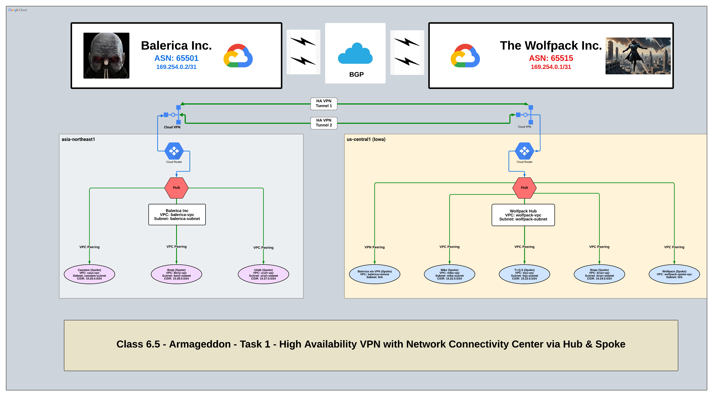
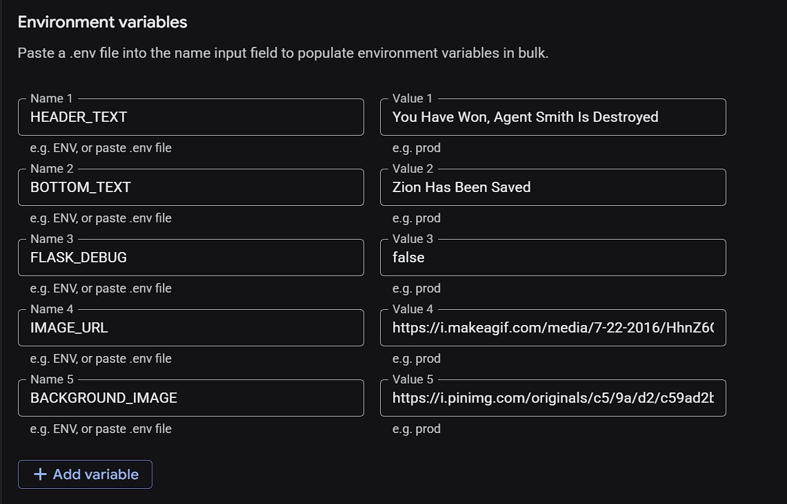
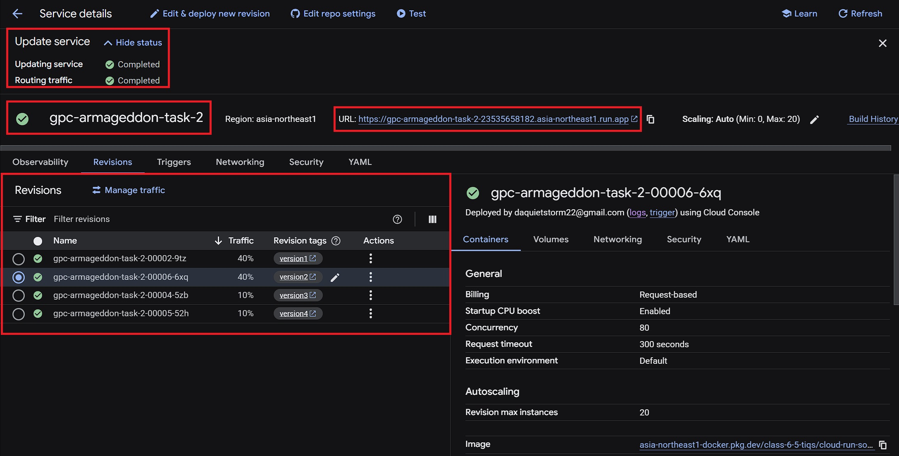
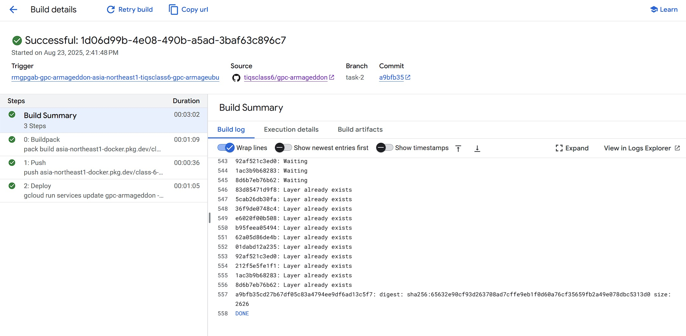

# Armageddon App (Task 2)

---


---

## 📝 Task

The **Dev team** wants to explore using **Cloud Run** to deploy their applications.  
Complete **"Be a Man #10"**, but now splitting traffic across **four applications** with the following distribution:  

- **Version 1** → 40%  
- **Version 2** → 40%  
- **Version 3** → 10%  
- **Version 4** → 10%  

> 🔗 **Reference GitHub Repo:** [cloud-run-ex Assignment](https://github.com/aaron-dm-mcdonald/cloud-run-ex/blob/main/assignment.md)

---



## 📖 Overview

This project is part of the **Armageddon App** series and demonstrates deploying a Python-based web application to Google Cloud Run.  
The application is structured with a minimal Flask app (`main.py`), templating via `index.html`, and environment configuration handled through `.env`.

---

## 📂 Project Structure

```plaintext
TASK-2/
│
├── Screenshots/
│   ├── armageddon-app-v1.jpg
│   ├── armageddon-app-v2.jpg
│   ├── armageddon-app-v3.jpg
│   ├── armageddon-app-v4.jpg
│   ├── cloud-build.jpg
│   ├── cloud-run-from-github.jpg
│   ├── cloud-run-initial-results.jpg
│   ├── cloud-run-revision2-step2.jpg
│   ├── cloud-run-revision2-step3.jpg
│   ├── cloud-run-revision2-variables1.jpg
│   ├── cloud-run-revision2-variables2.jpg
│   ├── cloud-run-revision3-variables2.jpg
│   ├── cloud-run-revision4-variables2.jpg
│   ├── cloud-run-service1.jpg
│   ├── cloud-run-service2.jpg
│   ├── cloud-run-split-traffic-revisions.jpg
│   ├── cloud-run-split-traffic.jpg
│   ├── cloud-run-with-revisions.jpg
│   ├── diagram.png
│   ├── github-commit-confirmation.jpg
│   └── setup-cloud-build.jpg
│
├── templates/
│   └── index.html          # HTML template rendered by Flask
│
├── .env                    # Environment variables file
├── .gitignore              # Git ignore configuration
├── main.py                 # Main Flask application
├── README.md               # Deployment guide and documentation
└── requirements.txt        # Python dependencies
```

---

## 🛠️ Tech Stack

- **Python 3**  
- **Flask** for web application framework  
- **Google Cloud Run** for serverless deployment  
- **Cloud Build** for CI/CD from GitHub  

---

## 🌐 Environment Configurations

### Version 1

```env
HEADER_TEXT=You Are The One Neo
BOTTOM_TEXT=Your Guide: The Oracle / Your Sensei: Theo WAF
FLASK_DEBUG=false
IMAGE_URL=https://64.media.tumblr.com/9ffbbd9e32309979709722811393cb10/fc79c935ca708e78-13/s540x810/06617f3d2f344b8280f96e67739c4f53417b4ddf.gif
BACKGROUND_IMAGE=https://i.pinimg.com/originals/c5/9a/d2/c59ad2bd4ad2fbacd04017debc679ddb.gif
```

### Version 2

```env
HEADER_TEXT=Fight Smith Until the End
BOTTOM_TEXT=The Fate of Zion Rests in Your Hands Neo
FLASK_DEBUG=false
IMAGE_URL=https://i.makeagif.com/media/7-01-2023/c8xnhX.gif
BACKGROUND_IMAGE=https://i.pinimg.com/originals/c5/9a/d2/c59ad2bd4ad2fbacd04017debc679ddb.gif
```

### Version 3

```env
HEADER_TEXT=Don't Give Up
BOTTOM_TEXT=Smith Doesn't Understand Why Do We Persist
FLASK_DEBUG=false
IMAGE_URL=https://i.makeagif.com/media/12-08-2018/thOxzT.gif
BACKGROUND_IMAGE=https://i.pinimg.com/originals/c5/9a/d2/c59ad2bd4ad2fbacd04017debc679ddb.gif
```

### Version 4

```env
HEADER_TEXT=Smith Is Destroyed
BOTTOM_TEXT=The Salvation of Zion Has Been Granted
FLASK_DEBUG=false
IMAGE_URL=https://i.makeagif.com/media/7-22-2016/HhnZ6O.gif
BACKGROUND_IMAGE=https://i.pinimg.com/originals/c5/9a/d2/c59ad2bd4ad2fbacd04017debc679ddb.gif
```

---

## 🖼️ Index HTML Template

The `index.html` file (stored under the `templates/` directory) provides the UI for the Flask app.  
It uses a **Matrix-style background**, dynamic headers and footers from environment variables, and a status panel.

```html
<!DOCTYPE html>
<html lang="en">
<head>
    <meta charset="UTF-8">
    <meta name="viewport" content="width=device-width, initial-scale=1.0">
    <title>Armageddon Task 2 - Flask App</title>
    <style>
        body {
            font-family: Arial, sans-serif;
            margin: 0;
            padding: 0;
            background: url('https://i.pinimg.com/originals/c5/9a/d2/c59ad2bd4ad2fbacd04017debc679ddb.gif') no-repeat center center fixed;
            background-size: cover;
            min-height: 100vh;
            display: flex;
            align-items: center;
            justify-content: center;
        }
        .container {
            background: rgba(0, 0, 0, 0.9);
            padding: 2rem;
            border-radius: 10px;
            box-shadow: 0 10px 30px rgba(0,0,0,0.5);
            text-align: center;
            max-width: 600px;
            width: 90%;
        }
        h1 {
            color:#00ff00;
            margin-bottom: 1rem;
            font-size: 2.5rem;
        }
        .info {
            background: rgba(20, 20, 20, 0.95);
            padding: 1rem;
            border-radius: 5px;
            margin-top: 1rem;
        }
        .info p {
            margin: 0.5rem 0;
            color:#b2f5b2;
        }
        .status {
            display: inline-block;
            background:#00c853;
            color: black;
            padding: 0.25rem 0.75rem;
            border-radius: 15px;
            font-size: 0.9rem;
            margin-top: 1rem;
            font-weight: bold;
        }
        .image-container {
            margin: 1.5rem 0;
            border
```

---

## 🚀 Deployment (Google Cloud Console Guide)

Follow these steps to deploy and configure **four revisions** of the Flask app with environment variations.

### Step 1 — Open Google Cloud Console

- Navigate to [Google Cloud Run](https://console.cloud.google.com/run).

### Step 2 — Create Service

- Click **Create Service**
- Choose **Continuously deploy from a repository (GitHub)**


- Click **Setup with Cloud Build**
- **Source Repository:**
  - Repo Provider: GitHub
  - Repo: *select your GitHub repo*
  - Confirm GitHub content transfer notice
  - Click **Next**

- **Build Configuration:**

### Step 3 — Build Configuration

- Branch: *select your branch* (e.g., `task-2`)
- Choose: *Go, Node.js, Python, Java, .NET Core, Ruby or PHP via Google Cloud buildpacks*
- Leave other fields default
- Click **Save**
  - 

### Step 4 — Configure

- Service Name: `gcp-armageddon-task-2`
- Region: *your region*
- Authentication: **Allow Public Access**
- Billing: leave default
  

- Service Scaling:
  - Min instances: `0`
  - Max instances: `20`
- Ingress: **Allow All**
  - 

  - 
  - 

### Step 5 — Environment Variables

- Expand **Containers, Volumes, Networking & Security**
- Go to **Variables & Secrets**
- Add environment variables (see versions below)
- **Revision 2 `.env`** 
  
- **Revision 3 `.env`** 

- **Revision 4 `.env`** 

- Click **Done**, then **Create**

### Step 6 — Create Additional Revisions

- Repeat **Step 5 (Variables & Secrets)** and **Deploy** three (3) more times to create four total revisions.
- Tag each revision under the **Revisions** tab:
  - `version1`
  - `version2`
  - `version3`
  - `version4`

### Step 7 — Split Traffic

> The service is deployed with **four revisions**, splitting traffic across them at **40% / 40% / 10% / 10%**.

- Click **Manage Traffic**
- Assign traffic as follows:
  - `version1` → 40%, `version2` → 40%, `version3` → 10%, `version4` → 10%
- Click **Save**.

- 
- 

### Step 8 — Verify

- Copy the service URL and paste in a new browser tab.
  - Service URL (example):  

      ```plaintext
         https://<service-name><service-account-number><region>.run.app
      ```

- Refresh multiple times to see randomized delivery across all four versions.

  - `version1` → 40%
  - 
  - `version2` → 40%
    
  - `version3` → 10%
    
  - `version4` → 10%
    
  - `Cloud Build`
    

---

## 🛠️ Troubleshooting

1. ModuleNotFoundError: No module named `flask`  

   ```bash
   pip install -r requirements.txt
   ```

1. Service deploys but returns 502/503  

   ```python
   app.run(host="0.0.0.0", port=int(os.environ.get("PORT", 8080)))
   ```

1. Permission denied when accessing the service  

   ```bash
   gcloud run services add-iam-policy-binding armageddon-app \
   --region us-central1 \
   --member="allUsers" \
   --role="roles/run.invoker"
   ```

1. Continuous Deployment build fails  

   ```bash
   gcloud services enable cloudbuild.googleapis.com
   ```

   Ensure GitHub repo is connected in **Cloud Build → Triggers**.

1. Environment variables not applied  
   Add under **Cloud Run → Service → Edit & Deploy New Revision → Variables & Secrets** and re-deploy.

---

## 📌 Notes

- Make sure to configure environment variables per version.  
- `.gitignore` ensures secrets and configs don’t get committed.  
- `requirements.txt` includes all Python dependencies.  

---

## ✍️ Authors & Acknowledgments

- **Author:** T.I.Q.S.
- **Group Leader:** John Sweeney

### 🙏 Inspiration

This project was built with inspiration, mentorship, and guidance from:

- Sensei **"Darth Malgus" Theo**
- Lord **Beron**
- Sir **Rob**
- Jedi Master **A-A-Ron**

Their wisdom, vision, and unwavering discipline made this mission possible.
